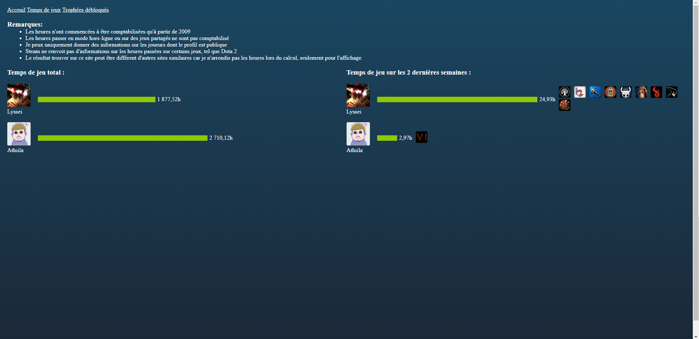

# test-steam-api

This was a test project to discover API's, and more precisely the steam api. By entering a steamId (for exemple 76561198034402880), you can get some information on the friends of the user. If their profils are public, you can see their playtimes, games and unlocked achievements.

Some request of the api changed since I did it, so there may be some errors. Also, if the user has a lot of friends/games/etc, it may be a bit slow. Other than that, it should work fine :).

